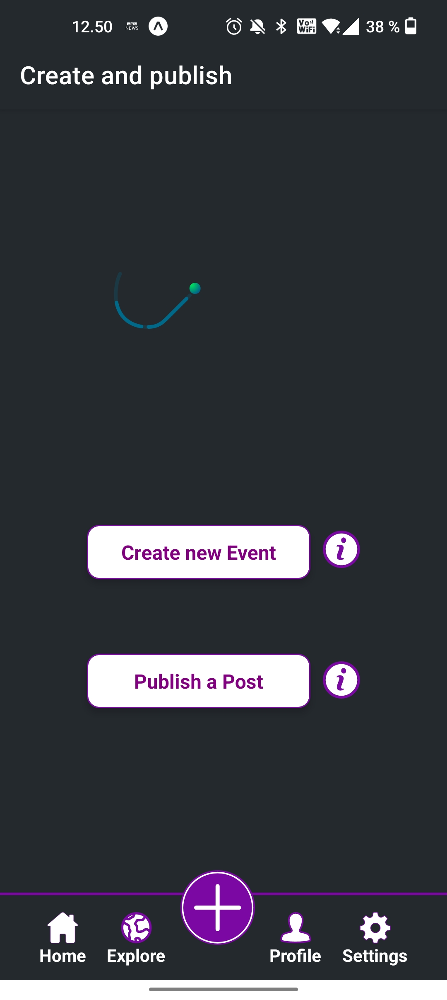
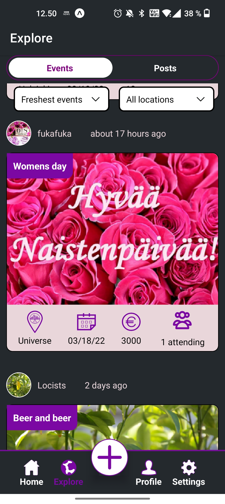
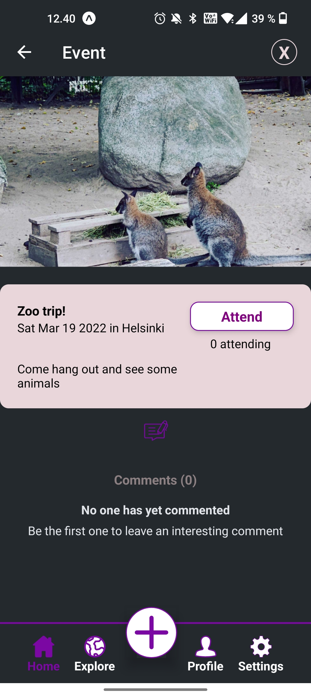
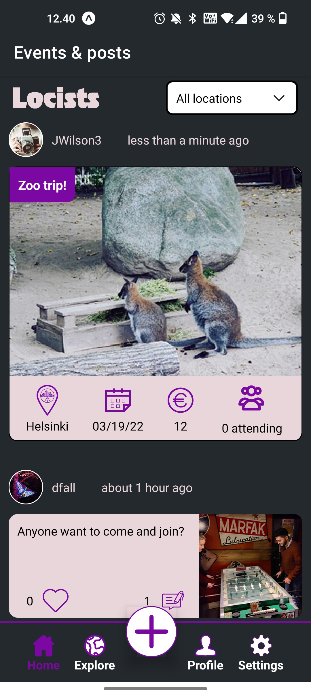

# Locists - WBMA final project - 2022
Members: Fuwad Kalhori and  David Fallow

Locists is a social media app centered around connecting users within the cities they live, users can make friends and share the bars/events they enjoy going to, posts can also benefit tourists who visit the city.

Developed, built and published with Trello, Figma, React Native and Expo for Android and iOS mobile devices.

3rd party libraries:

## Features of Application
- Login/SingUp
- Upload two types of media, events and posts. (Optional image upload for posts)
- Editing user details (Username, City, Password, Email, Profile Picture)
- View all media, View either events or posts, View own uploaded media in user profile
- Filter and search media
- Attend and comment on events
- Like and comment on posts

## Changes After User Feedback

- Altered properties within the app views, such as margins and padding in order to ensure that all content that is displayed is clearly visible
- Fixed issues concerning scrolling whilst the keyboard was open
- Fixed single event view to display image and other info correctly
- Before in single post, the post text could be mistaken for a comment, this has been fixed by changing the stlying of comments in order to differentiate the two
- Post creation view has been altered to be clearer for the user
- Added more animations thoughout the application and improved the design for the profile page by adding a banner photo
- Removed the previously instated max limit for password when registering an account

## Future Changes We Would Make Based on User Feedback
- Adding an attending list for the user, to keep track of events they are planning on attending
- Using the device location for the user and creating a map view for post/events near them
- Improving user interaction through friend/messaging capabilities

### Known Issues
- Pre-existing comments and after logging in the users city was marked as "gibberish" in their account details. This issue is caused when a user logs into our application with an account they set up in a different application which is using the same API.

## Documentation / other

[Github issues](https://github.com/FUKA-INNOVATIONS/locists/issues?q=is%3Aissue+is%3Aclosed)

[Trello - Kanban](https://trello.com/b/ncliokcT/local-social-media-locists)

[Ad video](https://www.youtube.com/watch?v=562t53vidhQ)

[App demo video](https://users.metropolia.fi/~fuwadk/WBMA/app-demo.mov)

[Figma prototype (original)](https://www.figma.com/file/EK3ip251gHwOp1nJYMYION/Locists-Prototype?node-id=0%3A1)

## ATTENTION!
App loading speed is slow which is not a code related issue. 
Used API was not originally designed for this purpose and speed issue is caused by API calls.
API CALLS is designed and customized in such way to fulfill app requirements.

[API documentation](https://media.mw.metropolia.fi/wbma/docs/#api-Media-GetSpecificMediaFile)

# Time Accounting
[Fuwad Kalhori](https://docs.google.com/document/d/1EXbJgu_B-QlssTCRnfq5rcCQjixfbUBaaHxafMMShFk/edit)
[David fallow](#)

## Screenshots

   
 
